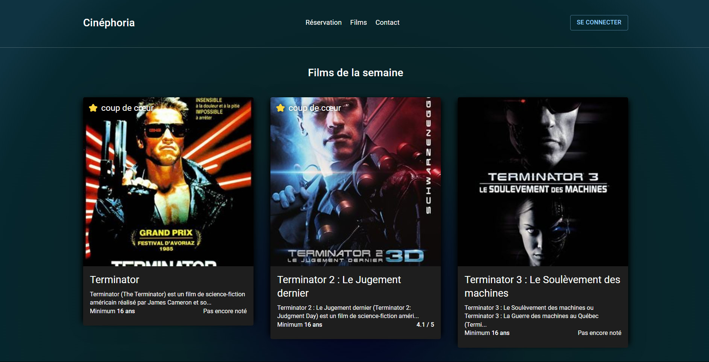
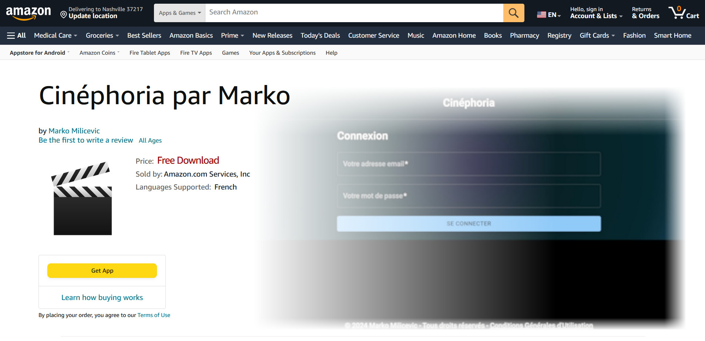
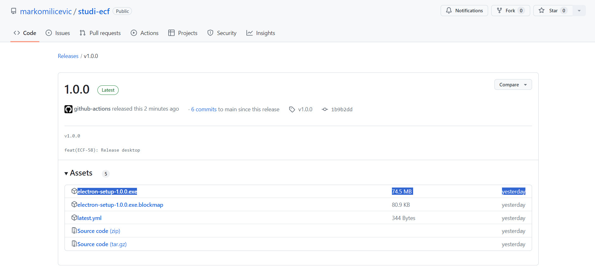
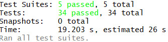

# Studi-ECF

## English speakers

This project is the main exercice of Frontend Developer Bachelor of the Studi school

The exercice is requiring the use of the French language on the documentation

You're encouraged to use a translation tool

## À propos

Ce projet présente l'Evaluation en Cours de Formation (ECF) du parcours de Bachelor Développeur Frontend de l'école Studi

Le projet porte sur la conception de A à Z du site web, de l'application mobile et de l'application bureau d'un cinéma factice

## Démonstration

- Site web : https://studi-ecf.markomilicevic.fr/



- Application mobile (Android) : https://www.amazon.com/gp/product/B0D7N1Q8TF



- Application bureau (Windows) : https://github.com/markomilicevic/studi-ecf/releases



## Installation

Veuillez suivre les instructions suivantes pour installer et lancer ce projet en local :

### Prérequis

Ce projet a été conçu et testé sous Windows 11

Les logiciels suivants doivent être installer à l'avance :

- Cygwin (ou un shell Linux, https://www.cygwin.com/ ) : testé OK avec la version 3.5.3
- Git (versionnement de fichiers, https://git-scm.com/ ) : testé OK avec la version 2.41.0.windows.1
- Node.js (execution de Javascript côté serveur, https://nodejs.org/ ) : testé OK avec la version 22.3.0
- Docker (afin d'automatiser les installations, https://www.docker.com/ ) : testé OK avec la version 24.0.7

Docker (aussi appelé `Docker Machine`) doit être lancer sur votre ordinateur

### Étapes

Ouvrir un terminal (Bash / WSL / `Cygwin Terminal` / ...) est procéder ainsi : 

```
# Récuperation du projet
git clone https://github.com/markomilicevic/studi-ecf.git

# Installer toutes les dépendences du projet (cette opération peux prendre plusieurs minutes)
cd studi-ecf
make install-dev

# Lancer toutes les applications (cette opération peux prendre 30 secondes)
make start-dev
```

Votre navigateur par défaut va se lancer avec les onglets suivants : 
- http://localhost:4001/ : Le site web
- http://localhost:4002/mobile : La version web de l'application mobile
- http://localhost:4003/desktop : La version web de l'application bureau

Toute modification sera automatiquement appliquée dans votre navigateur

### Finalisation

Il est possible de lancer les tests de bout-en-bout (aussi appelé `end2end`) afin de s'assurer que tout fonctionne correctement

Pour cela, il est nécessaire d'apporter une modification à `backend/.env` afin de pouvoir envoyer des emails

Commencer par ouvrir `backend/.env` et modifier la valeur `SENDGRID_API_KEY` avec une clé d'API SendGrid ( https://sendgrid.com/ )

Parce que les changements de `.env` nécessites de relancer les applications, exécuter les commandes suivantes :

```
# Arrêt de toutes les applications
make stop-dev

# Lancement à nouveau de toutes les applications
make start-dev
```

Enfin, lancer les tests de bout-en-bout :
```
make run-end2end-tests
```



Votre installation local est maintenant entièrement fonctionnelle

## Aller plus loin

- [Exemple de transaction SQL](doc/example.sql)
- [Manuel d'utilisation](doc/manual.pdf)
- [Gestion du projet](doc/project.md)
- [Style graphique](doc/styles.pdf)
- [Wireframes et mockups](doc/integration.md)
- [Architecture](doc/architecture.md) (**lecture commandée**)
