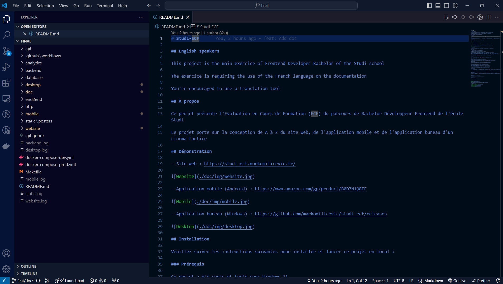
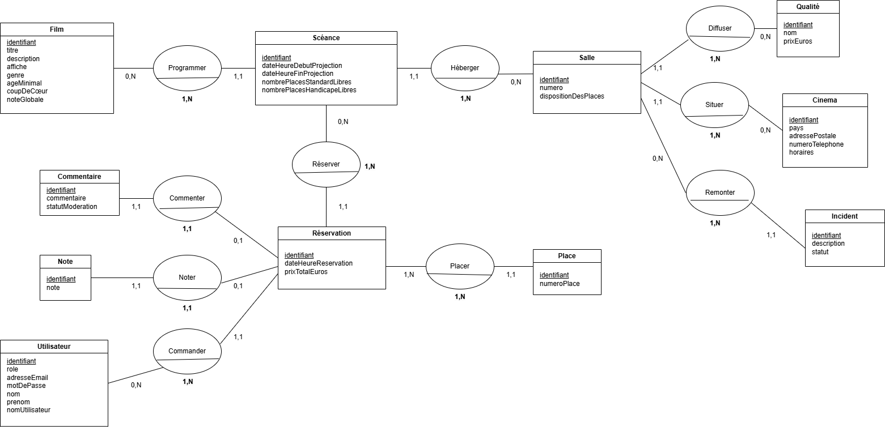
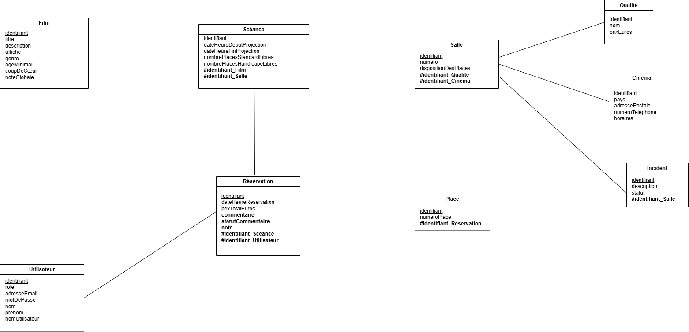
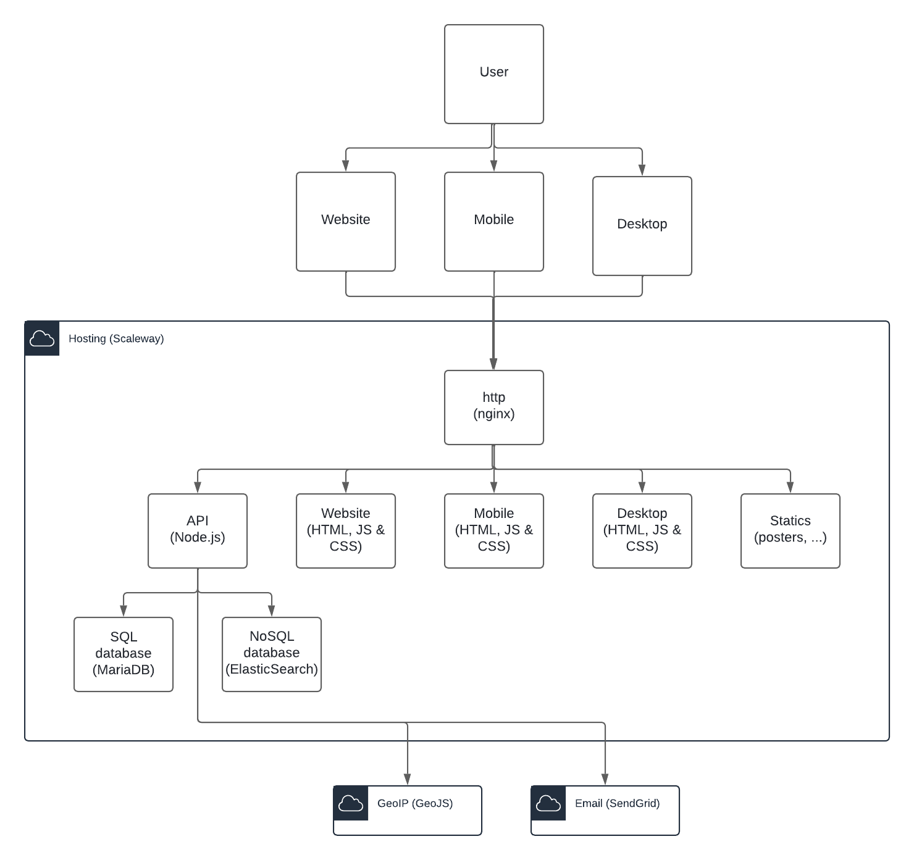
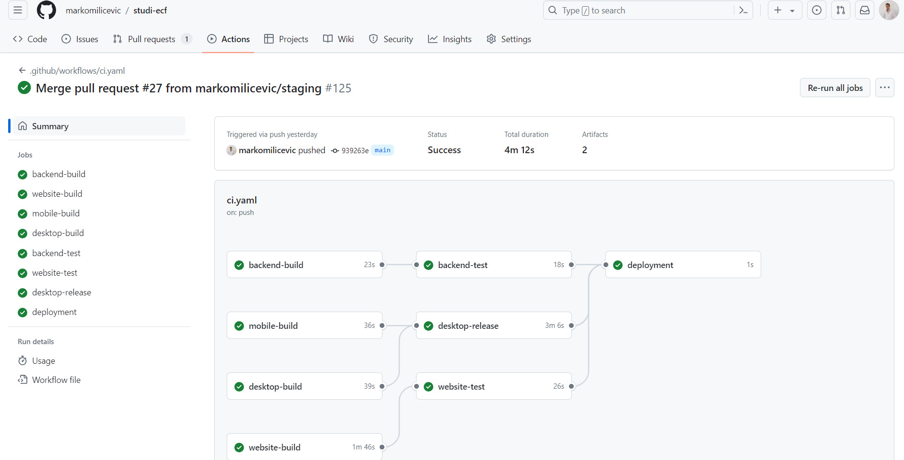

# Architecture

## À propos

Ce document présente comment le projet https://github.com/markomilicevic/studi-ecf a été architecturé

## Besoin

Il s'agit de concevoir :
- Un site web
- Une application mobile
- Une application bureau

## Comment

Pour développer, il a été décidé d'utiliser Visual Studio Code car :
- Standard de facto pour le développement d'applications
- Il est open source ( https://code.visualstudio.com/license )

Afin de centraliser l'authentification et les resources persistante, il a été décidé de :
- Créer une API (dossier `backend` du projet)
- Créer une base de donnée SQL (dossier `database` du projet)
- Créer une base de donnée NoSQL (dossier `analytics` du projet)

Ainsi, les divers applications utiliseront toutes une seule API commune

## Choix global

### API

Dans les règles de l'art, une API de type REST réponds aux besoins : 
- Avoir des URLs compréhensible (ressource/sous-ressource)
- Utiliser les verbes HTTP (GET, POST, PUT et DELETE) 

Node.js ( https://nodejs.org/ ) se prête bien à la création d'une API REST :
- Il est très performant ( https://blog.rafaelgss.dev/state-of-nodejs-performance-2023 )
- Il propose le framework Express permettant de concevoir facilement des API REST ( https://expressjs.com/ )
- Il propose Jest permettant de tester l'application ( https://jestjs.io/ )
- Il est open source ( https://github.com/nodejs/node/blob/main/LICENSE )

L'architecture **Domain Driven Design** (DDD) se prête bien avec une séparation par domaine (User, Movie, Session, ...) pouvons améliorer la maintenance du code.

La **Clean Architecture** se prête bien afin de rendre le code réutilisable et testable.

### Base SQL

Il a été décidé d'utiliser la base de donnée relationnelle MariaDB car :
- Elle est robuste et est utiliser abondamment en remplacement à MySQL
- Elle est open source ( https://mariadb.com/kb/fr/licences-de-mariadb/ )

#### Modéle

##### MCD (Modèle Conceptuel des Données)

##### MLD (Modèle Logique des Données)

Film(<ins>identifiant</ins>, titre, description, affiche, genre, ageMinimal, coupDeCoeur, noteGlobale)

Séance(<ins>identifiant</ins>, dateHeureDebutProjection, dateHeurFinProjection, nombrePlacesStandardLibres, nombrePlacesHandicapeLibres, #identifiant_Film, **#identfiant_Salle**)

Salle(<ins>identifiant</ins>, numéro, dispositionDesPlaces, #identifiant_Qualité, **#identifiant_Cinama**)

Qualité(<ins>identifiant</ins>, nom, prixEuros)

Cinéma(<ins>identifiant</ins>, pays, adressePostale, numeroTelephone, horaires)

Incident(<ins>identifiant</ins>, description, statut, **#identifiant_Salle**)

Utilisateur(<ins>identifiant</ins>, role, adresseEmail, motDePasse, nom, prénom, nomUtilisateur)

Réservation(<ins>identifiant</ins>, dateHeureReservation, prixTotalEuros, commentaire, statutCommentaire, note, **#identifiant_Séance**, **#identifiant_Utilisateur**)

Place(<ins>identifiant</ins>, numeroPlace, **#identifiant_Reservation**)

### Base NoSQL

Il a été décidé d'utiliser la base de donnée document ElasticSearch car :
- Elle est robuste et est utiliser abondamment pour du stockage et recherche de documents (JSON)
- Elle est open source ( https://www.elastic.co/fr/pricing/faq/licensing )

### Site Web, application mobile et application bureau

Dans les règles de l'art, il s'agit de plusieurs applications React ( https://react.dev/ ):
- React propose un développement dit "reactif et par composants
- React propose Create React App permettant de concevoir facilement une application React ( https://create-react-app.dev/ )
- Il propose Storybook afin de documenter et tester le comportement des composants ( https://storybook.js.org/ )
- React propose Jest permettant de tester l'application ( https://jestjs.io/ )
- React est open source ( https://github.com/facebook/react/blob/main/LICENSE )

Le choix d'utiliser exclusivement React permet de :
- N'avoir qu'un seul langage pour le développement (gain de temps car activité professionnelle à plein temps en parallèle)
- PWABuilder permet de créer une "progressive web app" fonctionnant sous forme de "web view" ( https://www.pwabuilder.com/ )
- Electron permet de créer une application native sous forme de "web view" (Windows, Mac et Linux, https://www.electronjs.org/ )
- À terme le code Javascript peut être mutualiser pour simplifier la maintenance et l'évolution

### Nom de domaine

Afin de gagner du temps, il a été décié de réutiliser le nom de domaine `markomilicevic.fr` car :
- Cela permet d'enrichir le portfolio / CV
- Cela ne coûte rien de plus financièrement

### Hébergement

Utilisant Node.js, une base de donnée MariaDB et une base de donnée ElasticSearch, il a été décidé d'utiliser un serveur dédiée car :
- Contrôle totale sur l'installation (utilisant de SSH pour les commandes et SCP pour les transferts de fichiers)
- Scaleway ( https://www.scaleway.com/ ) propose une offre attractive et répondant aux besoins en terme de resources

### Localiser l'utilisateur

Afin de préseletioner le pays en cours, il a été décidé d'utiliser GeoJS ( https://www.geojs.io/ ) car :
- Il localise le pays d'après une IP, travers une API REST
- Il propose une offre gratuite suffisante

### Envoyer des emails

Afin d'envoyer des emails, SendGrid ( https://sendgrid.com/ ) a été choisit car : 
- Il propose une bonne délivrabilité des emails (à travers le protocol SMTP)
- Il propose une offre gratuite suffisante

### Certificats SSL/TLS

Il a été décidé d'utiliser exclusivement HTTPS à travers un certificat Let's Encrypt ( https://letsencrypt.org/ ) :
- Il est maintenu par une communauté
- Il propose une offre gratuite suffisante

**Attention** : Le certificat n'est valide que 3 mois, il faut donc le renouveller assez régulièrement avant sa date d'expiration

## Vue globale

## Choix détails

### Bibliothéques

Les bibliothéques suivantes ont était choisi par rapport à leur popularité (nombre d'étoiles sur GitGub)

| Besoin                                         | Solution                                                                                                      | Pros                                          | Cons                                                          |
|------------------------------------------------|---------------------------------------------------------------------------------------------------------------|-----------------------------------------------|---------------------------------------------------------------|
| Utiliser des tokens                            | Json Web Tokens ( https://jwt.io/ )                                                                           | Standard de facto                             | Contenu lisible (mais non modifiable sans cassé la signature) |
| Requête préparée à la base de donnée SQL       | Sequelize ( https://sequelize.org/ )                                                                          | Très bien fourni en fonctionnalités           | Plus aucune requête SQL écrite à la main                      |
| Afficher des composants                        | Material UI ( https://mui.com/ ) | Composants de bonnes factures                 | Plus lourd en taille d'un Bootstrap CSS                       |
| Afficher des notifications                     | Notistack ( https://notistack.com/ )                                                                          | API riche et facile à utiliser                | En supplément des composants Material UI                      |
| Afficher des dates humainement compréhensibles | Moment.js ( https://momentjs.com/ )                                                                           | Standard de facto                             | Connu pour être lourd à charger en taille                     |
| Afficher un QR code                            | react-qr-code ( https://github.com/rosskhanas/react-qr-code )                                                 | Facile à mettre en place                      | Communauté assez petite sur GitHub                            |
| Afficher un chart                              | Google Charts ( https://developers.google.com/chart )                                                         | Facile à mettre en place                      | Composant externe et non open source                          |
| Effectué des appels API                        | Axios ( https://axios-http.com/ )                                                                             | Standard de facto                             | Sera remplacer par `fetch` dans les navigateurs    |
| Gérêr un état d'appel API                      | react-query ( https://tanstack.com/query/latest )                                                             | Gère les temps de chargement et cas d'erreurs | Bien prendre connaisance du système de cache                  |

## Plan de tests

Le projet est composé de :
- Tests unitaires
- Tests bout-en-bout

Chaque mise en production nécessite :
- L'exécution automatique des tests unitaires par la CI/CD (par GitHub Actions)
- L'exéction manuelle des tests bout-en-bout sur l'environement local (commande `make run-end2end-tests`)

La mise en production ne peux être faite que si tous les tests sont aux vert

## Déploiements

Le déploiement :
- Est automatique sur la branche `main` par la CI/CD (GitHub Actions) 
- Est conditioné par la création d'un tag git pour construire l'application bureau par la CI/CD (GitHub Actions) 
- Un Web Hook est déclanché sur le serveur de production par la CI/CD (GitHub Actions) 
  - Le serveur se met à jour par rapport à GitHub
  - Le serveur se redémarre pour tout relancer

**Attention** : Parce qu'il n y a qu'un seul serveur (réduction des coûts), toute l'application est indisponible le temps du redémarrage. Plus tard, il serais intéressant d'avoir au moins deux serveurs et de faire un dépoiement progressif, serveur par serveur (sous forme de "pool")

## Sécurités

Les mesures suivantes sont en place :

- Nom de domaine et hébergement : 
  - Connexion avec email + mot de passe + facture multiple (MFA)

- Hébergement : 
  - Bloquer les tentatives de brute-force SSH avec fail2ban ( https://github.com/fail2ban/fail2ban )
  - Règles de firewall n'autorisant que certains ports d'ouvert à l'éxterieur
  - Exécution en compte utilisateur (non root)
  - SSL/TLS avec certification reconnu par les principaux navigateurs
  - Monitoring avec UptimeRobot ( https://uptimerobot.com/ )
  - Serveur Linux/Ubuntu à jour

- API :
  - Jeton d'authentification et cookie "httpOnly" (non accessible par le Front)
  - Mot de passe hacher avec l'algorithme SHA256
  - Requêtes préparés pour empecher les attaques par injection SQL

- Front :
  - Usage de React pour empecher les attaques XSS (le HTML est par défaut échappé)
  - Téléversement de fichiers images : 
    - Vérification du type "mime" (envoyé par l'utilisateur)
    - Vérification de l'extension (dernière partie du nom du fichier temporaire)
    - Vérification de la taille (taille maximale accepté par le serveur HTTP et taille du fichier téléversé)
    - Création des images finales avec bibliothéque de gestion d'images

- Légal :
  - Page des Conditions Générales d'Utilisation ( https://studi-ecf.markomilicevic.fr/tos )
