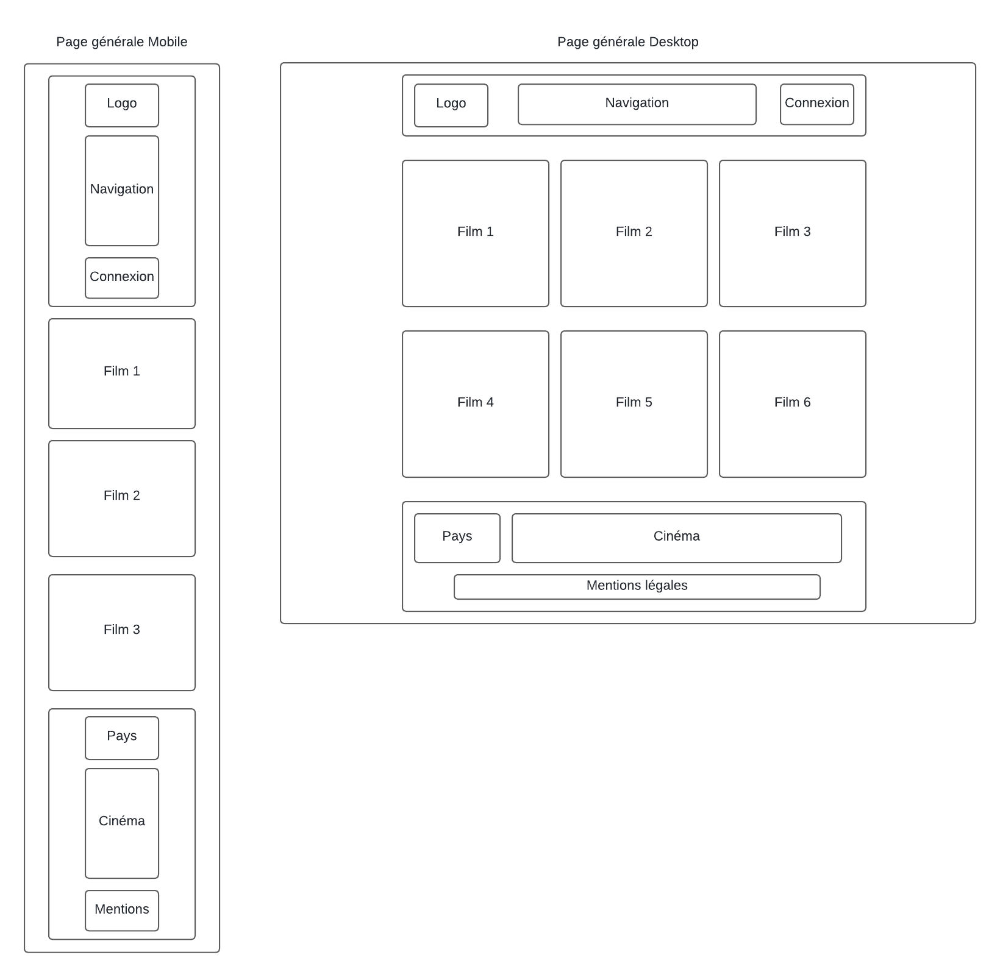
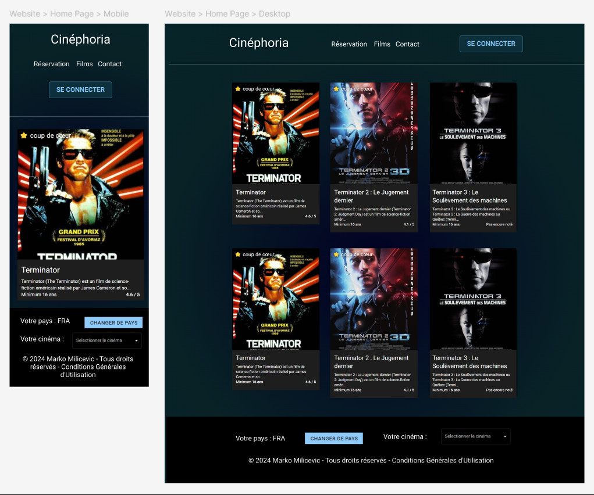
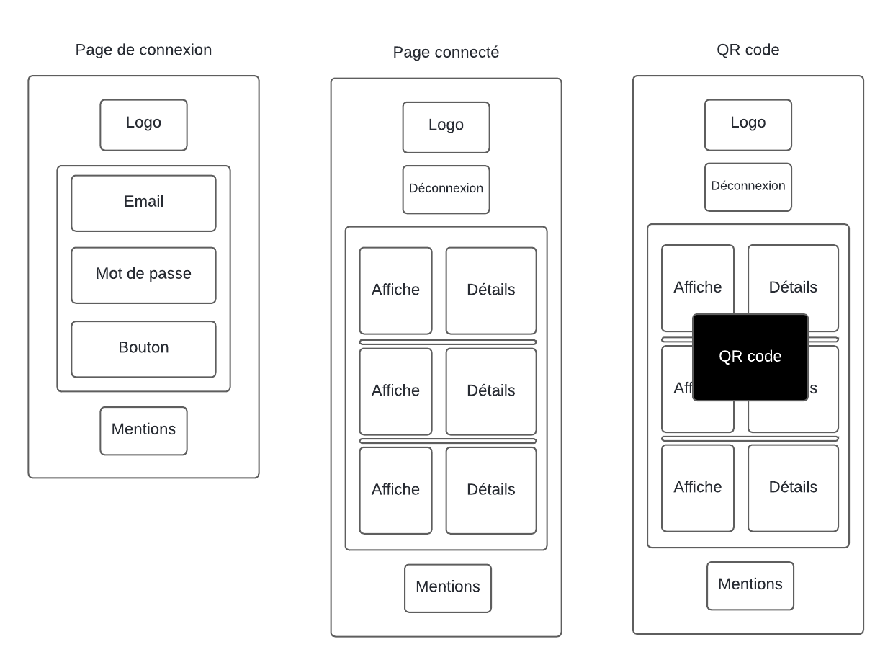
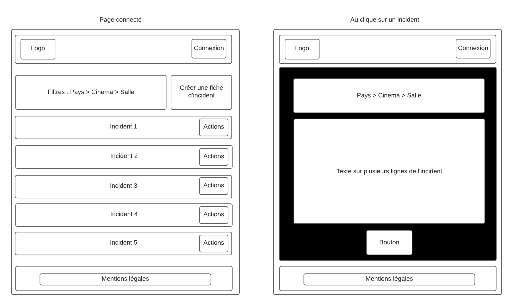
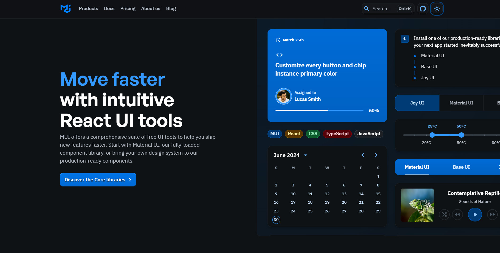

# Wireframes et mockups

## À propos

Ce document présente les wireframes et mockups du projet https://github.com/markomilicevic/studi-ecf

## Contexte

**Important** : L'énoncé de l'exercice ne précise pas de maquette, il s'agit ici d'une réalisation personnelle

## Site web

### Wireframes

### Mockups

## Application mobile

## Application bureau

## Généralités

Tous les composants et grilles viennent de Material UI ( https://mui.com/ )

