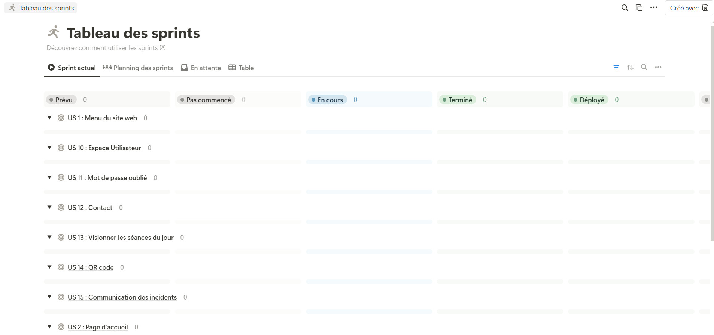
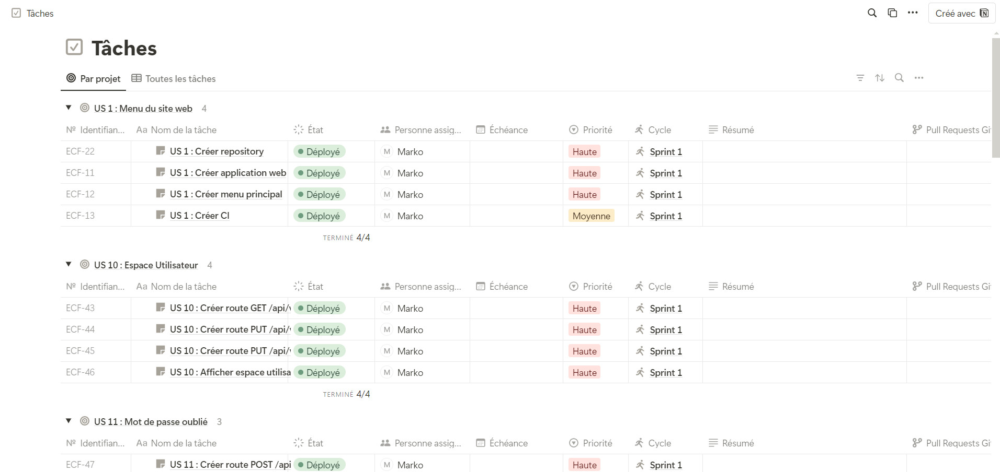

# Gestion du projet

## À propos

Ce document présente comment le projet https://github.com/markomilicevic/studi-ecf a été géré

## Contexte

Le document `Enoncé_TP Concepteur développeur d’applications.pdf` fourni par Studi contient déjà les User Stories

Il s'agit de concevoir de A à Z, plusieurs livrables pour un cinéma factice : 
- Livrable 1 : Le site web
- Livrable 2 : L'application mobile
- Livrable 3 : L'application bureau

## Méthodologie

La méthodologie Agile a été utilisée avec la composante Kanban : 
- Un Sprint = un livrable, ce choix a été fait car ce projet a été conçu sur le temps disponible assez réduit (activité professionnelle à plein temps en parallèle)
- Faute d'avoir le client commanditaire du projet, aucun retour client n'a pu être fait durant ce projet, **ceci est un point négatif du projet qui peut mener un tout autre projet à son échec si le client n'est pas inclus tout au long du processus de développement** (effet "tunnel")

### Divers

Les autres composantes Agile sont utilisées : 
- Git Flow ( https://www.atlassian.com/fr/git/tutorials/comparing-workflows/gitflow-workflow )
  - Branche par fonctionnalité
  - Branche d'intégration (`staging`)
  - Branche de production (`main`)
- Pull Request : revue par une seule personne dans le projet
- CI/CD : avec tests et déploiement automatique

## Outil

Notion ( https://www.notion.so/ ) est utilisé :
- Il propose une vue Kanban
- Il propose une offre gratuite suffisante

URL : https://wooded-english-733.notion.site/de7aeb112f5647f780ed11c44edd94b5?v=9bafce1313994b9ea25c1d5a7474d2fd

## Cycle

- Un Sprint est défini par un livrable
- Chaque livrable est défini par une liste de User Stories
- Chaque User Story est défini par une ou plusieurs tâches technique

URL : https://wooded-english-733.notion.site/7c77fa40e5ab4ffd8ad2be5cf4206c40?v=5749c26bd0894e81927c3df238980828

## Livraison

Des tests bout-en-bout sont disponibles afin de garantir une qualité optimal des livrables
